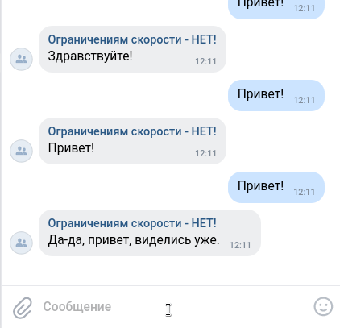

# Telegram и VK бот технической поддержки издательства "Игра глаголов"

Отвечает на вопросы пользователей, связанные с работой издательства.

## Примеры работы

### Telegram


### Вконтакте



### Как установить

Код является свободным, ты можешь установить его и пользоваться. Для этого тебе понадобится:

1. Установить Python 3.10+. [см. как установить (англ.)](https://realpython.com/installing-python/), а [здесь для Debian-based (рус.)](http://userone.ru/?q=node/41).

2. Получить Telegram API ключ для клиентского бота, который будет вести диалог с пользователями. Для этого напиши [Отцу ботов](https://telegram.me/BotFather) и ответь на его вопросы.

3. Также тебе понадобится Telegram-бот для ведения логов, логгер-бот. Действуй по аналогии с предыдущим пунктом.

4. Получить ключ Вконтакте для доступа к сообщениям группы, см. [инструкцию](https://vk.com/dev/bots_docs?f=1.1.%20%D0%9F%D0%BE%D0%BB%D1%83%D1%87%D0%B5%D0%BD%D0%B8%D0%B5%20%D0%BA%D0%BB%D1%8E%D1%87%D0%B0%20%D0%B4%D0%BE%D1%81%D1%82%D1%83%D0%BF%D0%B0)

5. Создать [проект](https://cloud.google.com/dialogflow/es/docs/quick/setup) DialogFlow и [агента](https://cloud.google.com/dialogflow/es/docs/quick/build-agent), получить [json-ключ](https://cloud.google.com/docs/authentication/getting-started) и загрузить его в папку проекта.

5. Установить ключи в переменных окружения (см. ниже), а также указать **полный** путь до json-ключа в переменной GOOGLE_APPLICATION_CREDENTIALS.

Далее, скачай репозиторий к себе, установи и активируй виртуальное окружение:
```
    python3 -m venv env
    source env/bin/activate
```
установи необходимые библиотеки, указанные в файле requirements.txt:
```
    pip install -r requirements.txt
```
перейди в папку проекта и запусти Telegram-бот:
```
    python3 bot_tg.py
```
Если у тебя возникает ошибка *chat not found* — напиши своему боту в Telegram. Пока ты не напишешь ему, у него нет чата с тобой. Это защита от рекламных рассылок, поэтому боты не могут написать пользователям первыми.

Бот Вконтакте запускается так:
```
    python3 bot_vk.py
```


## Переменные окружения

Для улучшения уровня безопасности все ключи размещай в переменных окружения, в файле *.env*:

```
TG_TOKEN="<token of client bot>"
TG_LOGGER_TOKEN="<token of logger bot>"
TG_LOGGING_CHAT_ID="<id of the chat where to send logs>"
VK_TOKEN="<token of VK bot>"
GOOGLE_APPLICATION_CREDENTIALS="<path to the google cloud credential json file>"
GOOGLE_CLOUD_PROJECT_ID='<google cloud project id>'
GOOGLE_CLOUD_PROJECT_LANGUAGE_CODE='ru'
```

### Деплой

Разместить скрипт можно на [Heroku](https://devcenter.heroku.com/articles/getting-started-with-python) (не рекомендую, но если захочешь - используй Procfile из репозитория) или на сервере, см. например, [инструкцию для Django](https://habr.com/ru/post/501414/), из которой достаточно взять только часть для установки скрипта, опустив установку базы данных и т.п.

### Цель проекта

Код написан в образовательных целях на онлайн-курсе для веб-разработчиков [dvmn.org](https://dvmn.org/).
